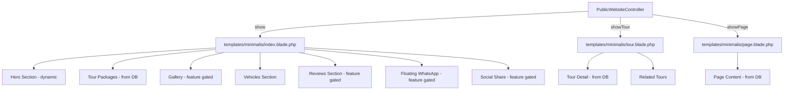

# Plan: Konversi Template Minimalis ke SaaS-Ready Blade Template

## Analisis Situasi Saat Ini

### Masalah
File [`resources/views/templates/minimalis/index.html`](resources/views/templates/minimalis/index.html) adalah **static HTML file** yang:
- Menggunakan hardcoded data (nama "Wanderlust Tours", tour data di JavaScript)
- **Bukan Blade template** (ekstensi `.html` bukan `.blade.php`)
- **Tidak terintegrasi** dengan backend SaaS (tidak ada dynamic data dari database)
- **Tidak mendukung feature flags** (reviews, gallery, whatsapp, social share)
- **Hanya single-page** — tidak ada file `tour.blade.php` atau `page.blade.php`

### Template Luxury Sebagai Referensi
Template luxury di [`resources/views/templates/luxury/`](resources/views/templates/luxury/) sudah terintegrasi penuh dengan:
- Blade templating dengan dynamic data dari `$website`, `$settings`, dll
- Feature flags dari subscription plan
- 3 file: `index.blade.php`, `tour.blade.php`, `page.blade.php`
- Alpine.js untuk interaktivitas (lightbox, mobile menu, social share)
- SEO meta tags dan JSON-LD review schema

---

## Data yang Tersedia dari Controller

[`PublicWebsiteController::show()`](app/Http/Controllers/PublicWebsiteController.php:21) melewatkan variabel berikut:

| Variabel | Tipe | Deskripsi |
|----------|------|-----------|
| `$website` | Website | site_name, subdomain, logo_url, contact_whatsapp |
| `$settings` | WebsiteSetting | site_title, primary_color, secondary_color, font_heading, font_body, hero_title, hero_subtitle, hero_image_url, seo_meta_description, gallery_images |
| `$vehicles` | Collection | model_name, capacity_people, price_per_day, image_url |
| `$tourPackages` | Collection | title, slug, description, price_start_from, thumbnail_url, duration_text, itinerary, includes, excludes, is_featured |
| `$features` | Array | floating_whatsapp, social_share, gallery_lightbox, reviews |
| `$reviews` | Collection | reviewer_name, reviewer_email, rating, comment, is_approved |
| `$reviewSchema` | Array | JSON-LD structured data |
| `$galleryImages` | Collection | url, alt |
| `$pages` | Collection | title, slug, content, is_published, sort_order |
| `$subdomain` | string | Subdomain identifier |

---

## Arsitektur File yang Akan Dibuat



---

## Rencana Detail Per File

### 1. `resources/views/templates/minimalis/index.blade.php`

Konversi dari `index.html` menjadi Blade template dengan perubahan berikut:

#### a. PHP Setup Block (baru)
```php
@php
    $homeUrl = isset($subdomain) && $subdomain ? '/s/' . $subdomain : '/';
    $primaryColor = $settings->primary_color ?? '#2D5A47';
    $secondaryColor = $settings->secondary_color ?? '#1A1A1A';
    $fontHeading = $settings->font_heading ?? 'Cormorant Garamond';
    $fontBody = $settings->font_body ?? 'DM Sans';
@endphp
```

#### b. Head Section
- Dynamic `<title>` dari `$settings->site_title`
- SEO meta description dari `$settings->seo_meta_description`
- Dynamic Google Fonts dari `$fontHeading` dan `$fontBody`
- CSS variables menggunakan `$primaryColor` dan `$secondaryColor`
- Tambah Font Awesome CDN (untuk ikon)
- Review JSON-LD schema jika feature aktif

#### c. Navigation
- Logo dari `$website->logo_url` atau fallback icon
- Site name dari `$settings->site_title`
- Dynamic menu dari `$pages` collection
- WhatsApp CTA button dari `$website->contact_whatsapp`
- Mobile menu dengan Alpine.js

#### d. Hero Section
- Background image dari `$settings->hero_image_url`
- Title dari `$settings->hero_title`
- Subtitle dari `$settings->hero_subtitle`
- Stats dinamis: jumlah tour packages, rating, jumlah vehicles
- Tombol CTA: "Lihat Paket Tour" dan "Lihat Galeri"

#### e. Featured Tours Section
- Loop `$tourPackages` dari database
- Card dengan: thumbnail, title, description, price, duration
- Link ke detail tour: `/s/{subdomain}/tour/{slug}`
- Badge "Best Seller" jika `is_featured`

#### f. Gallery Section (feature-gated)
- Hanya tampil jika `$features['gallery_lightbox']` aktif
- Loop `$galleryImages` collection
- Lightbox dengan navigasi prev/next menggunakan Alpine.js

#### g. Vehicles Section
- Loop `$vehicles` dari database
- Card dengan: image, model_name, capacity, price_per_day

#### h. Reviews Section (feature-gated)
- Hanya tampil jika `$features['reviews']` aktif
- Loop `$reviews` yang approved
- Review form dengan rating stars (Alpine.js)
- POST ke `route('public.reviews.store', $website->subdomain)`

#### i. Footer
- Dynamic branding dari `$settings`
- Dynamic page links dari `$pages`
- Contact info dari `$settings` (phone, email, address)
- Social links dari `$settings`
- "Powered by adaylink"

#### j. Floating WhatsApp (feature-gated)
- Hanya tampil jika `$features['floating_whatsapp']` aktif dan `$website->contact_whatsapp` ada

#### k. Social Share FAB (feature-gated)
- Hanya tampil jika `$features['social_share']` aktif
- WhatsApp, Facebook, Twitter share, copy link

#### l. Scripts
- Alpine.js CDN
- Gallery lightbox function
- Social share function

---

### 2. `resources/views/templates/minimalis/tour.blade.php` (baru)

Tour detail page mengikuti pola dari [`luxury/tour.blade.php`](resources/views/templates/luxury/tour.blade.php):

- Hero gallery dengan tour images
- Tour info: title, description, duration, price
- Tab content: Itinerary, Includes/Excludes, Notes
- Booking card sticky sidebar dengan WhatsApp CTA
- Related tours section
- Same navigation, footer, feature flags

#### Data dari `PublicWebsiteController::showTour()`:
- `$tour` - TourPackage model dengan images loaded
- `$relatedTours` - 3 tour terkait
- `$website`, `$settings`, `$features`, `$pages`, `$subdomain`

---

### 3. `resources/views/templates/minimalis/page.blade.php` (baru)

Custom page view mengikuti pola dari [`luxury/page.blade.php`](resources/views/templates/luxury/page.blade.php):

- Dynamic page title dari `$page->title`
- Page content dari `$page->content` (rendered as HTML)
- Same navigation, footer, feature flags

#### Data dari `PublicWebsiteController::showPage()`:
- `$page` - Page model
- `$website`, `$settings`, `$features`, `$pages`, `$subdomain`

---

### 4. Hapus `resources/views/templates/minimalis/index.html`

File static yang lama dihapus setelah konversi selesai.

---

## Perbandingan Sebelum dan Sesudah

| Aspek | Sebelum (index.html) | Sesudah (index.blade.php) |
|-------|---------------------|--------------------------|
| Format | Static HTML | Blade Template |
| Data | Hardcoded JS | Dynamic dari database |
| Branding | "Wanderlust Tours" | Dari `$settings->site_title` |
| Tour Data | 6 hardcoded tours | Dari `$tourPackages` collection |
| Navigation | Static links | Dynamic dari `$pages` |
| Feature Flags | Tidak ada | floating_whatsapp, social_share, gallery_lightbox, reviews |
| Gallery | Tidak ada | Feature-gated dengan lightbox |
| Vehicles | Tidak ada | Section dari `$vehicles` |
| Reviews | Static testimonials | Feature-gated + review form |
| SEO | Basic | Meta description + JSON-LD |
| Tour Detail | JS SPA page | Separate `tour.blade.php` |
| Pages | Tidak ada | Separate `page.blade.php` |
| Colors/Fonts | Hardcoded CSS | Dynamic dari `$settings` |

---

## Desain Minimalis yang Dipertahankan

Meskipun diintegrasikan dengan backend, estetika minimalis akan tetap dipertahankan:
- Clean whitespace dan subtle shadows
- Rounded corners (16px-24px)
- Soft color palette (cream, sage green)
- Elegant typography (Cormorant Garamond + DM Sans)
- Smooth scroll reveal animations
- Hover effects pada cards
- Minimal visual noise
